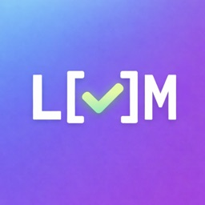

<div align="center">
  
  <h1>LiveMark</h1>
  <p>Keep an eye on what your coding agent is doing to your Markdown files.</p>
</div>

<p align="center">
  <a href="https://github.com/rcoenen/LiveMark/releases/latest"></a>
  <a href="https://github.com/rcoenen/LiveMark/releases"></a>
  <a href="https://github.com/rcoenen/LiveMark/actions/workflows/ci.yml"></a>
  <a href="LICENSE"></a>
</p>

LiveMark renders local Markdown files and refreshes the preview whenever they change on disk. Open several documents in tabs and keep their previews running side by side.

LiveMark uses Tauri and the native macOS WebView, so it does not bundle Electron, Chromium, or Node.js.

## Install

```sh
brew tap rcoenen/livemark https://github.com/rcoenen/LiveMark
brew install --cask rcoenen/livemark/livemark
```

Or:

```sh
curl -fsSL https://raw.githubusercontent.com/rcoenen/LiveMark/main/scripts/install.sh | bash
```

Or download the [DMG](https://github.com/rcoenen/LiveMark/releases/latest), drag LiveMark into Applications, then:

```sh
xattr -cr /Applications/LiveMark.app
```

## Why LiveMark?

I built LiveMark for myself to improve observability in my coding workflows. Coding agents generate and update a lot of Markdown files, and I wanted a simple way to keep an eye on those changes as they happen. I needed this tool after MacDown was retired. Although MacDown worked through Rosetta, it was never updated to run natively on Apple silicon.

## Features

- Live preview on every file save
- Multiple independently updating document tabs
- GitHub-flavored Markdown and syntax highlighting
- Light and dark themes
- Selection-aware copy as Markdown
- Finder, drag-and-drop, Open dialog, and CLI support

## CLI

Install the `livemark` command from the LiveMark application menu, then open one or more files:

```sh
livemark README.md notes.md
```

## Develop

Prerequisites: Node.js 20+, npm, the stable Rust toolchain, and Xcode Command Line Tools on Apple silicon macOS 11 or newer.

```sh
npm ci
npm run dev
```

Run checks and create the signed local release artifacts:

```sh
npm test
npm run build
npm run dist
```

The release command writes the ad-hoc-signed app, DMG, zip, and checksums to `src-tauri/target/release/bundle/macos/` and `dist/`.
