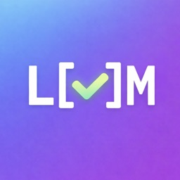

<div align="center">
  
  <h1>LiveMark</h1>
  <p>Keep an eye on what your coding agent is doing to your Markdown files.</p>
</div>

<p align="center">
  <a href="https://github.com/rcoenen/LiveMark/releases/latest/download/LiveMark-mac.dmg"></a>
  <a href="https://github.com/rcoenen/LiveMark/releases"></a>
  <a href="https://github.com/rcoenen/LiveMark/releases"></a>
  <a href="https://github.com/rcoenen/LiveMark/releases"></a>
  <a href="https://github.com/rcoenen/LiveMark/actions/workflows/ci.yml"></a>
  <a href="LICENSE"></a>
</p>

LiveMark renders local Markdown files and refreshes the preview whenever they change on disk. Open several documents in tabs and keep their previews running side by side.

LiveMark uses Tauri. On macOS it uses the system WebView, and on Windows it uses WebView2. It does not bundle Electron, Chromium, or Node.js.

The download counts are the installer packages only: macOS `.dmg` files, and Windows `*-setup.exe` files. Checksums, signatures, and the updater manifest are not included.

## Install

### Mac

```sh
brew tap rcoenen/livemark https://github.com/rcoenen/LiveMark
brew install --cask rcoenen/livemark/livemark
```

Upgrade with:

```sh
brew update && brew upgrade --cask livemark
```

`brew upgrade` alone uses the tap copy already on this Mac. `brew update` fetches the cask from GitHub first. Homebrew only does that fetch automatically about once a day.

Or:

```sh
curl -fsSL https://raw.githubusercontent.com/rcoenen/LiveMark/main/scripts/install.sh | bash
```

Or download the [DMG](https://github.com/rcoenen/LiveMark/releases/latest/download/LiveMark-mac.dmg), drag LiveMark into Applications, then:

```sh
xattr -cr /Applications/LiveMark.app
```

A copy installed from the DMG updates from inside the app. A Homebrew install does not: Homebrew stays the only writer of that copy.

The first time you open a packaged copy of this version, it becomes the app for `.md` and `.markdown` files. A double-click then opens that file in LiveMark.

### Windows

Experimental pre-release only.

[LiveMark_1.6.3_x64-setup.exe](https://github.com/rcoenen/LiveMark/releases/download/v1.6.3-windows.1/LiveMark_1.6.3_x64-setup.exe)

This is the x64 installer for Intel and AMD PCs. It installs for the current user, under `%LOCALAPPDATA%\LiveMark`, and does not ask for an administrator account. The installer is unsigned. Windows SmartScreen shows **More info**, then **Run anyway**.

This preview does not replace the latest Mac release or the Homebrew cask.

Installers built from this version make LiveMark the app for `.md` and `.markdown` files. A double-click then opens that file in LiveMark. The preview linked above was built earlier and leaves the current app in place.

## Why LiveMark?

I built LiveMark for myself to improve observability in my coding workflows. Coding agents generate and update a lot of Markdown files, and I wanted a simple way to keep an eye on those changes as they happen. I needed this tool after MacDown was retired. Although MacDown worked through Rosetta, it was never updated to run natively on Apple silicon.

## Features

- Live preview on every file save
- Multiple independently updating document tabs
- GitHub-flavored Markdown and syntax highlighting
- Light and dark themes
- Selection-aware copy as Markdown
- Finder, Explorer, drag-and-drop, Open dialog, and CLI support

## CLI

Install the `livemark` command from the LiveMark application menu, then open one or more files:

```sh
livemark README.md notes.md
```

On Mac the command is linked to `/usr/local/bin`. On Windows it is added to your user PATH. Open a new terminal after installing it.

## Develop

On Mac: Node.js 20+, npm, the stable Rust toolchain, and Xcode Command Line Tools on Apple silicon macOS 11 or newer.

On Windows: Node.js 20+, npm, the stable Rust toolchain with the MSVC target, and WebView2 (already present on Windows 11 and current Windows 10).

```sh
npm ci
npm run dev
```

Run checks and create the signed local macOS release artifacts:

```sh
npm test
npm run build
npm run dist
```

The macOS release command writes the ad-hoc-signed app, DMG, zip, and checksums to `src-tauri/target/release/bundle/macos/` and `dist/`. A published tag builds that DMG and one Windows setup, `LiveMark_<version>_x64-setup.exe`, together. That release stays a pre-release until it is promoted, so it does not replace the latest release or the Homebrew cask.
